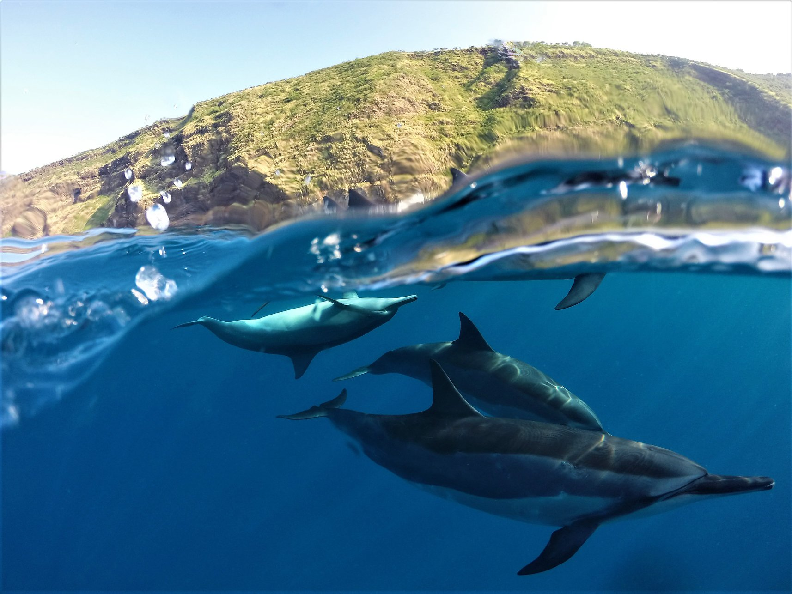
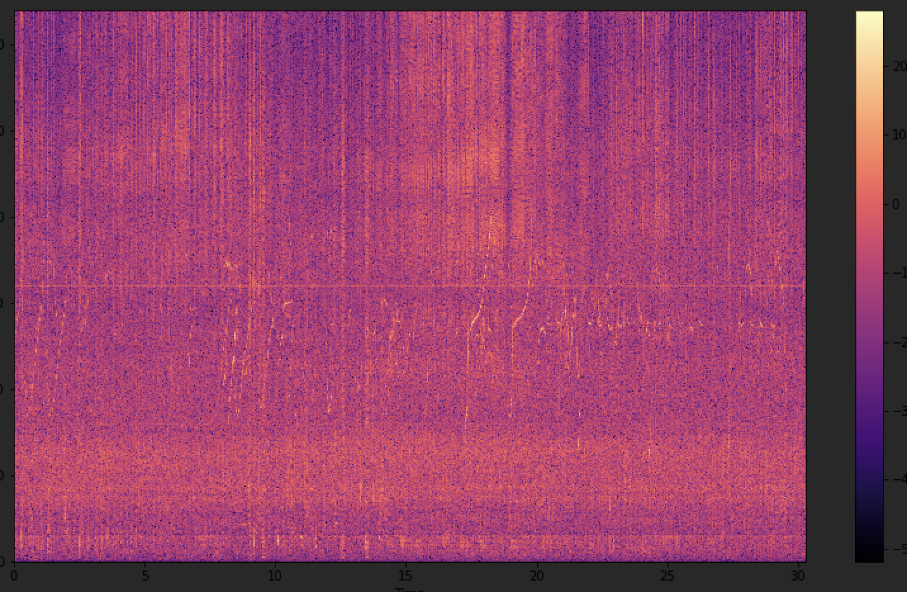
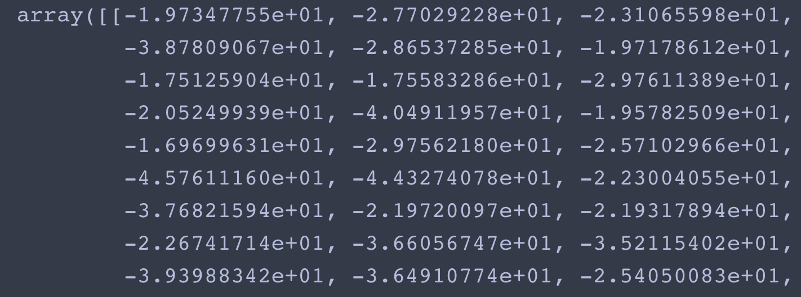
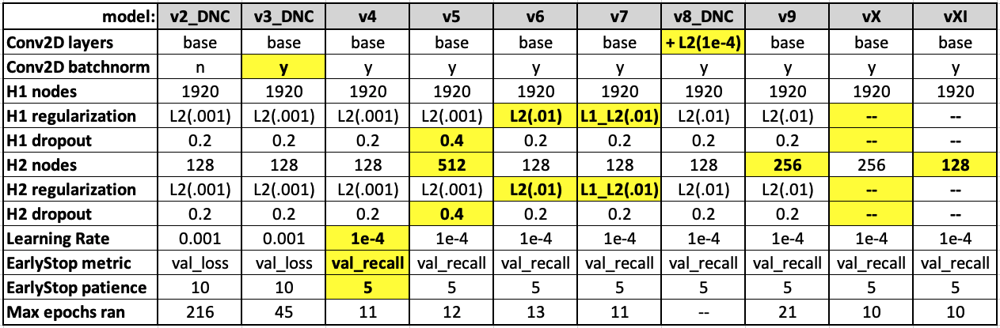
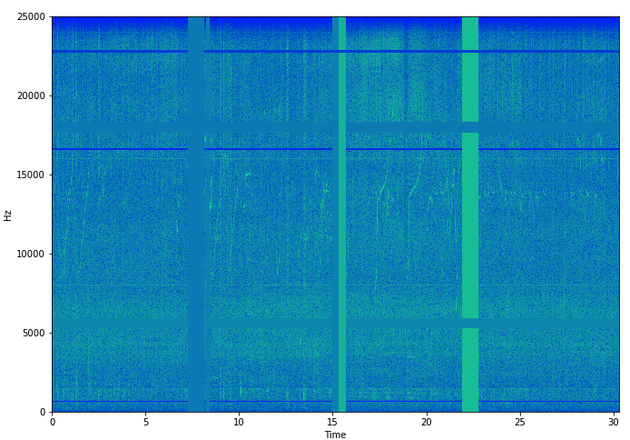
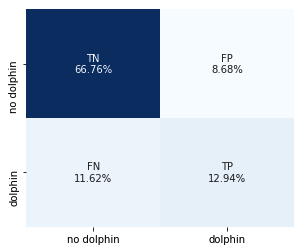
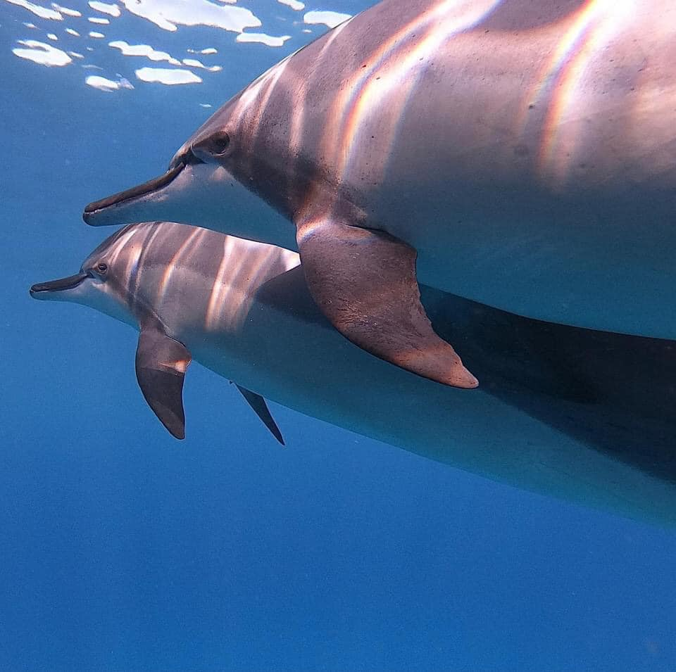

# Marine Bioacoustic Identification: _Stenella longirostris_

### Background
The goal of this project is to create a model that can identify marine mammal presence/absense from passive acoustic monitoring data. The inspiration for this undertaking is that once upon a time I had to do this identification manually; it is the epitome of a task where automation would vastly improve the speed and efficacy of research (not to mention the quality of life of research techs). I have recently been exploring neural nets with dummy datasets, and this struck me as an ideal way to apply these concepts to real world data. My former employer was gracious enough to provide recent data, and eager to see results, as this identification is _still_ done mostly manually by techs and graduate students. 

Marine mammal (MM) acoustic identifiers do exist, but the unique environment of these data make them only partially helpful. All data used here are from hydrophones stationed nearshore around the Hawaiian Islands. The ambient noise in all recordings is dominated by snapping shrimp year round, and whale song for 4-6 months of the year. The shrimp provide a particular challenge because their noise pollution is in the form of broadband clicks which span the entire frequency range of a recording. Their noise is also the cumulative sound of millions of organisms producing acute snaps; to the human ear it sounds like static white noise, and it cannot be traced along a spectrogram like a loud, long, whale song.

Existing MM acoustic identification devices often prioritize whales, whereas the contributing researchers here are interested in the much quieter _Stenella longirostris_, aka spinner dolphins. 

 Hawaiian spinner dolphins (S. longirostris). Photo by Kawika Singson  

 

In beginning lit review for this idea I learned unsurprisingly that people have been at this for years; since long before I was doing it manually. There is not yet a catch-all program for MM ID in use because of the breadth of environmental nuances, and likely the required computing power. At least that was an obstacle I came up against. This is not a dissertation, so for now it  only scratches the surface of developing an actual research-ready tool. However, it still represents good practice of neural network implementation on real world data, and a reference for further study.

Ideally, this product will eventually identify spinner clicks and whistles, and/or distinguish different marine mammal species, but the first step tackled here is a spinner presence/absense indicator.

---

### Problem Statement
Bioacousticians in Hawaii are studying the acoustic behavior and habitat use of spinner dolphins around the Hawaiian Islands. To do so, they plant hydrophones in various sites for 2 to 12 months at a time, recording :30s clips every 5 minutes.  These dolphins reside and traverse mostly nearshore, so recording devices are in or adjacent to reef habitats. The audio is heavily polluted with sounds from reef biota (snapping shrimp in particular), which can obscure faint whistles and clicks. Automated acoustic identification programs do exist for whistles, but during whale season (about 5 months of the year), these are rendered unhelpful as these do not discriminate between dolphin and whale tones. Thus, dolphin presence/absence is logged manually by a person looking and listening to each :30 clip.

This project strives to train a convolutional neural network (CNN) to identify spinner dolphin presence/absence, in the presence of typical ambient reef and whale sounds.

This project utilizes librosa for manipulating audio data, and tensorflow and keras for CNN. AWS was explored for additional computing power through external servers, but ultimately could not provide better results than work conducted locally.

---

### Methods
#### Data
Data were provided by [Oceanwide Science Institute](http://oceanwidescience.org/) (OSI). Data comprise ~1TB of recordings from nine sites around the Hawaiian Islands, and 11 different deployments. Site depths range from 12-70m, and deployment duration ranges from 52-62 days. All deployments took place in 2016, spanning nine months of the year (no data from April, May, and December). Sample rates were either 50KHz or 64KHz. Most spinner dolphin vocalizations (whistles) are captured in the 12-25 KHz frequency band, while their clicks are broadband.

CNNs are a go-to for image data, but can also be used for spectrograms. Which is a roundabout way of saying _spectrograms are not images_. Spectrograms are matrix representations of audio signals, rendered on axes of time (x), frequency (y), and intensity (color). The sizes of frequency and time bins dictate the resolution of the information, and are dictated by the user-defined parameters of the short time Fourier Transform (STFT). A Fast Fourier Transform (FFT) breaks down a signal into individual spectral components, giving us frequency information. This information applies to the sample as a whole (:30). The STFT divides this longer signal into smaller samples, performs the FFT on each sample, and stitches them together sequentially so we have some semblance of the change in signal over time. The STFT sampling method can be thought of as a sliding window, usually with 50-75% overlap between samples. The specifications used here for generating spectrograms are described in [notebook_02](https://github.com/welcometohelen/marine_bioacoustic_identifier/blob/main/notebooks/02_wav_to_spects.ipynb).

An example spectrogram looks like this to us:

 spectrogram with high spinner activity  

 

And like this to the CNN:

 same same to CNN  

  

See [notebook_00](https://github.com/welcometohelen/marine_bioacoustic_identifier/blob/main/notebooks/00_intro_to_spectrograms.ipynb) for more example spectrograms from this dataset and their associated audio.
  

Each spectrogram was scaled to itself by Standard Scaler: the mean was subtracted from each value in the array, and all values were divided by the standard deviation of that array. Arrays were _not_ standardized across the dataset. The theory behind this is that these data span multiple environments, and are impacted by a variety of externalities. If we were trying to classify site, these nuances might be important, but for presence/absence across all environments, we want each spectrogram considered independently. Secondly, scaling across all training data would mean this same scaling would have to be applied to all future datasets. Given that the specific deployment sites for hydrophones will vary over time (but still be in the generally similar Hawaii locale), this could result in one day scaling new data based on parameters (mean, std, etc) that are no longer present.

##### Data Limitations
The main takeaway of spectrograms being _not images_, is that they contain much more information. In images, each axis represents the same metric, and pixels are colorized on a fixed scale (255). Manipulating spectrograms - to trim edges at frequency or time thresholds, for example - can require smoothing, resampling, windowing, and other techniques to maintain continuity. Despite downsampling all spectrograms, memory limitations still restricted the scope of this analysis. Ultimately, data were batched and mini-batched for CNN training, and the number of filters and depth of CNN were adjusted to fit within available resources. Fitting all data at once, adding complexity to the NN, or increasing resolution of the spectrograms will all require external memory and GPU access, which was not available here. (I tried, but external GPUs are crazy hard to come by right now).

#### Model Training
The entire dataset provided by OSI (11 complete hydrophone deployments) contained 3% positives files (yes_dolphin), and 97% no_dolphin files. For training purposes, all positive files were utilized, but only a subset of negatives were used. The negative subset was generated by random sample across all deployments to achieve a 1:3 p:n ratio in training. Thus, models here must illustrate accuracy > 75% to be better than baseline.

Once a base CNN was established (ie, converged), hyperparameters were tuned to optimize recall. Recall - aka true positive rate aka sensitivity aka the one with too many aliases - is the priority metric here, because identifying all of the rare dolphin encounters is critical. All versions with remotely competitive recall were saved for final evaluation on a holdout test set.  The parameters of all versions subjected to final testing are described in the figure below. For each of these versions, a model was trained with and without augmented data.

Once the superior model was identified through holdout evaluation, this model was refit 4 times (a total of 5 fits) and average performance was analyzed.  See [notebook_06](https://github.com/welcometohelen/marine_bioacoustic_identifier/blob/main/notebooks/06_holdout_validation.ipynb) for methods and results.

#### Data Augmentation
Each model version that made it to holdout validation was also trained on data that incorporated augmented spectrograms, which were generated during spectrogram preprocessing. These are referred to as 'masked' spectrograms throughout the code, and consist of randomly placed bands of constant amplitude along both time and frequency axes.

 

Data augmentation is a common practice in CNN training. Results from training with and without mask incorporation were saved separately for comparison. For those exposed to masked data, the masked spectrograms were mixed into some (but not all) of the training subsets. Masked spectrograms were created for a random 30% of positive files, and a random 10% of negative files. Thus, this augmentation doubled as a strategy for burgeoning the minority class.

---

### Summary

Eleven versions of CNN were explored here; all trained with and without augmented data. Baseline accuracy was 75%, and the best model consistently achieved over 79% accuracy across multiple fits. The best model was vX when exposed to augmented training data, described above in 'Model Training'.

As mentioned, our priority metric is recall. Though a 1:3 (p:n) ratio was used in training and validating this model, the true split in the cumulative data across deployments was 97% negative files and only 3% positive. Given the rarity of a positive, it is critical to identify every one, even at the expense of accumulating false positives. If a program could grab 10% of the total dataset and guarantee that the ~3% dolphin encounters were in there, this would still drastically reduce the human workload: now a person needs only to go through 9,000 audio files just to weed out false positives instead of 90,000. That's a lot of room for activities.  Even with a high false positive rate - leading to low specificity, precision, and accuracy on paper - it would still be useful. However, if there is also a significant false negative rate which must be vetted manually, there is no utility.

The highest recall achieved here is 52.6%. Though a vast improvement from the many 0.00000s in preliminary trials, we still have a formidable percentage of false negatives. The max recall of 53% means that 47% of the positive dolphin files are not captured.  The aggregate performance over 5 fits is lower still: 40% recall, so 60% of dolphin files misclassified as no_dolphin. Despite better-than-baseline accuracy, the number of false negatives needs to be significantly reduced for this model to become a viable research tool.

 Best performance by a single model. Deteriorates when averaging scores over multiple fits but let's look at this one instead.  

  

For 70% of the versions tested here, exposing the model to augmented data during training yielded improved performance across all classification metrics.  We cannot definitively say if this is due to the _masks_ alone, or due to the increased p:n training ratio resulting from the addition of masked data.

---

### Conclusions

vX likely represents the near-maximum recall achievable with this depth of neural network.  So far, this project is hopefully a sound basis for pursuing more advanced and effective models for MM acoustic identification using CNN. Next steps with this existing structure include:

1. Get more positive files: a burgeoned minority would help greatly.
    * OSI is willing to contribute, so novel positive files are a realistic possibility
    * In lieu of new positives, fabricating more positives by stacking pos/neg or pos/pos could help balance classes artificially
2. Reinstantiate and retrain the other competitive versions in this line up: given the variation seen in vX refitting, it may be that another version here is equally competitive or better when averaged across multiple fits.
3. Use a platform or machine that can execute model.predict() in order to identify what misclassified files look like: are they dominated by whale calls or anthropogenic sounds, or just empty ambient files? Can this guide conv filter arrangement or spectrogram preprocessing (STFT) parameters?
4. Experiment with the mask function: does a different combination/orientation of masks improve performance?
5. Experiment with different methods of scaling the spectrograms. There are several methods used in relevant literature, including no scaling at all.

Despite ample steps to explore locally, the main obstacle to improving a model with these data is increased memory and GPUs. External server options were pursued but still did not allow for fitting the entire dataset at once, let alone increasing CNN depth or complexity.  GPUs were unavailable through multiple providers; and a c5ad.4xlarge instance on AWS repeatedly crashed from OOM while working with even this shallow architecture.  With increased computing resources, priority steps include:
1. Double the number of filters in each conv2d layer of the superior model.
2. Deepen the NN: related literature points to VGG-19, ResNet-50, and AlexNet as deep-layer NNs that have been employed for marine mammal acoustic tasks with better success
    * There are even keras supported versions of [VGG-19](https://keras.io/api/applications/vgg/) and [ResNet-50](https://keras.io/api/applications/resnet/), but they will require significant tuning and/or gridsearching to tailor to spectrograms. Though not a pre-existing keras architecture, there are also examples of [how to code AlexNet for tensorflow](https://analyticsindiamag.com/hands-on-guide-to-implementing-alexnet-with-keras-for-multi-class-image-classification/).
3. Explore the specific STFT parameters recommended at the end of [notebook_02](https://github.com/welcometohelen/marine_bioacoustic_identifier/blob/main/notebooks/02_wav_to_spects.ipynb)

  

---

Citations  
* [Daniels Discoveries. 2017](https://danielsdiscoveries.wordpress.com/2017/09/29/spectrogram-input-normalisation-for-neural-networks/) Spectrogram input normalisation for neural networks.
* [Downey, A.B. 2014](https://greenteapress.com/wp/think-dsp/) Think DSP: Digital Signal Processing in Python. Version 1.1.1. _Green Tea Press_.
* [Padovese et al. 2021.](https://asa.scitation.org/doi/full/10.1121/10.0004258) Data augmentation for the classification of North Atlantic right whales upcalls. _Journal of the Acoustical Society of America_ 149:4.
* [Shiu et al. 2020.](https://www.nature.com/articles/s41598-020-57549-y) Deep neural networks for automated detection of marine mammal species. _Nature: Scientific Reports_ 10:607.
* [Singh, Neha. 2020.](https://arrow.tudublin.ie/cgi/viewcontent.cgi?article=1222&context=scschcomdis) _Classification of animal sound using convolutional neural network. Masters Dissertation. Technological University Dublin_. DOI:10.21427/7pb8-9409
* [T.D. 2019.](https://medium.com/@dtuk81/confusion-matrix-visualization-fc31e3f30fea) Confusion Matrix Visualization.
* [Thomas et al. 2019.](https://ecmlpkdd2019.org/downloads/paper/314.pdf) Marine Mammal Species Classification using CNN and a Novel Acoustic Representation. 
* Personal correspondence: <*> Lisa Munger <*> Gwen Rathgeber <*> Charles Rice
* I did not brush up on correct citation format. Forward all complaints to https://github.com/charles-rice
